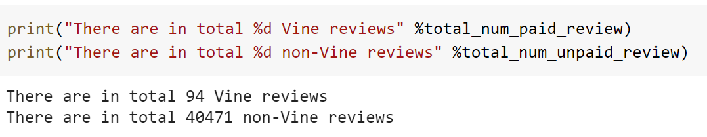
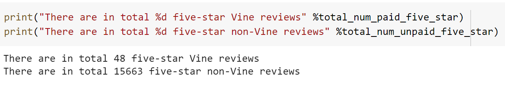
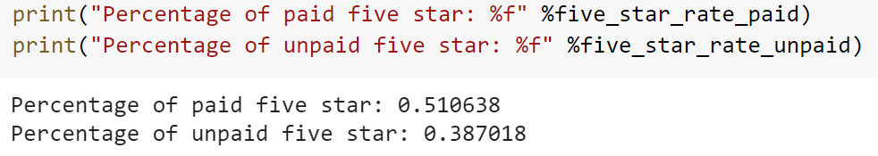

# Amazon_Vine_Analysis
Apache Hadoop (Hadoop), mrjob library (python), Apache Spart (Spark), Pyspark, Google Colaboratory (Colab), Data Tokenization, PySpark Machine Learning (ML) library, AWS SQL database, AWS S3 data storage, Database CRUD (create, read, update, delete), AWS SQL ETL flow, Naïve Bayes Model (ML)

## Overview of the analysis
A large volume dataset (include all the customer reviews of online video game purchase) is collected from Amazon S3 storage bucket for data processing/cleaning to determine if bias exists in Amazon reviews for being or not being the members of the paid Amazon Vine program. Data is processed using python pyspark and then gets loaded into AWS RDS instance Postgres for further relational analysis. The analysis below illustrates the existance of bias toward favorable review from Vine members from the dataset.  

## Results
- In total, there are 94 Vine reviews and 40471 non-Vine reviews.  
  
- There are 48 Vine reviews that have five stars and 15663 non-Vine reviews that have five starts.  
  
- The percentage of five_star Vine reviews is 51.0638% and the percentage of five_star non_Vine reviews is 38.7018%.  

